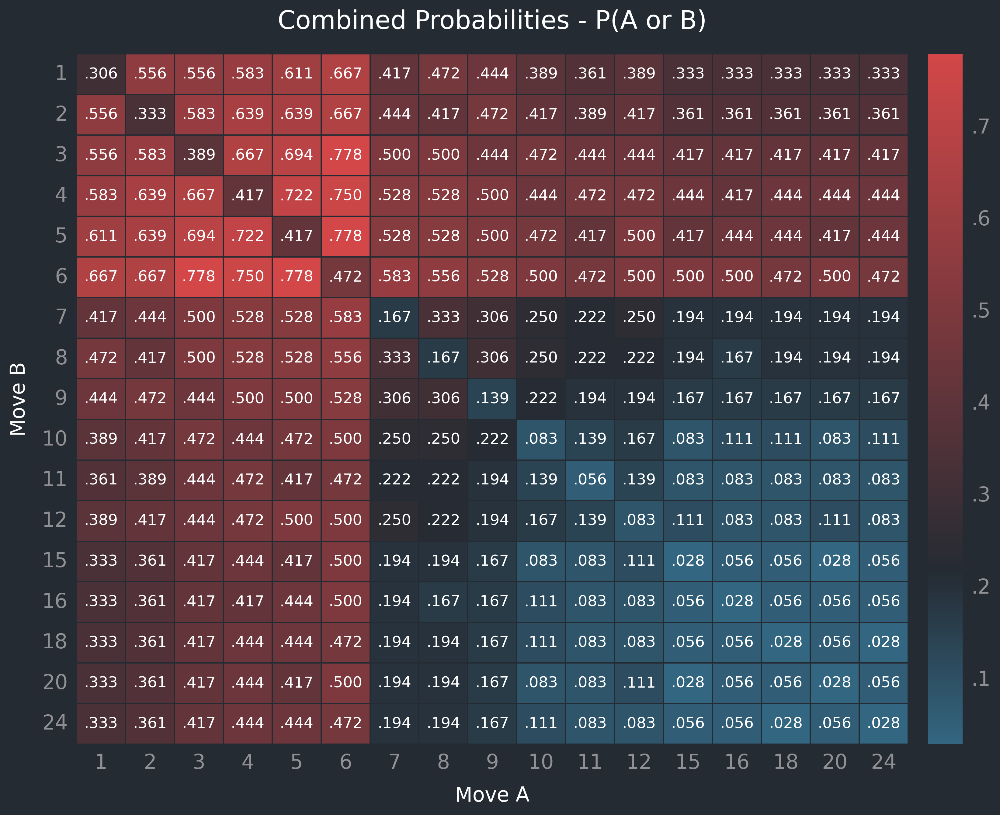

# Backgammon

**Overview**

The use of dice in backgammon presents questions of discrete probability, and also a simple scenario for experimenting with data analysis and visualisation.

The rule on rolling doubles, and the feature of being able to take the face value of each die alone or in combination (see below), make this a (marginally) more interesting subject than typical probability calculations for two six-sided dice.

**Background**

Backgammon is a boardgame, the roots of which date back as many as 5,000 years ([Wikipedia](https://en.wikipedia.org/wiki/Backgammon)) to table games originating in Mesopotamia and Persia.

The modern game involves two players alternating turns to roll two six-sided dice, the scores of which determine how many spaces each player may move their own pieces.

**Basic rules**

Knowledge of the full rules of backgammon isn't necessary to follow this exercise, but one typical version (with graphics) can be accessed [here](https://www.bkgm.com/rules.html).

For the purpose of this repo, relevant rules are as follows:

- The board consists of 24 "points" (spaces).

- Players roll two six-sided dice to determine the number of spaces they can move.

- Moves are made separately or in combination; for a roll of [4, 5], a player can move:

  - one piece 4 spaces and a second piece 5 spaces, or
  - one piece 9 spaces.

- Doubles (e.g., [5, 5]) permit four moves rather than two (i.e., [5, 5, 5, 5]), to be used in combination on between one and four pieces.

- Players can move onto any space permitted by their dice roll, unless it has two or more pieces belonging to the opponent.

- If a player lands on a space with the opponent's lone piece, that piece is removed to the "bar" and the opponent must re-enter it from their starting point on their next turn.

**Note on possible moves**

The "bar" is effectively space 0, so the total range of moves a piece could travel during one turn is from 1 to 24 spaces (24 in the case of rolling [6, 6]) - but not all numbers within that range are achievable.

The doubles rule makes it possible to reach 15, 16, 18, 20, and 24, as well as skewing the probabilities of reaching the face value numbers between 1 and 12.

**About this repo**

Questions explored within this repo, include:

1. For each possible move _n_, what is the probability of being able to move n spaces?

   

   _Example: the probability of being able to land on an opponent's piece 9 spaces away is 5/36, ~13.89%._

2. For each pair of moves (_m_, _n_), what is the probability of being able to move **either** _m_ **or** _n_ spaces?

   

   _Example: the probability of being able to move either 4 spaces or 12 spaces is 17/36, ~47.22%._

3. The probability of attacking an opponent's piece under movement constraints - i.e., where inbetween spaces are obstructed by two or more opposing pieces, and cannot be landed on.
