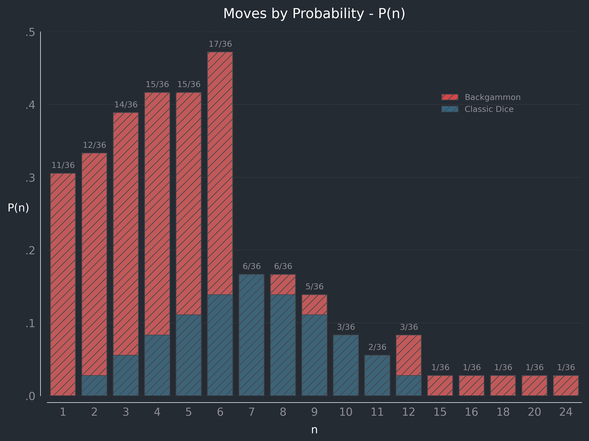
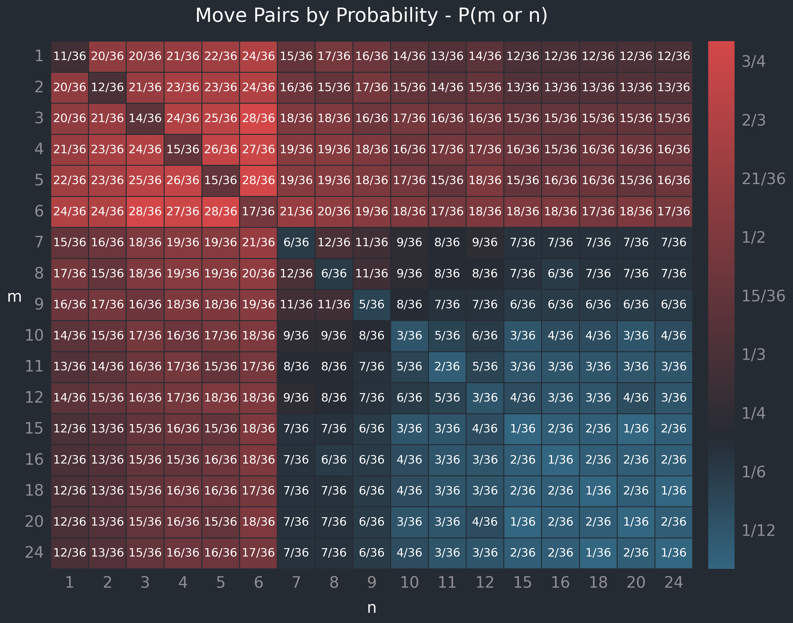
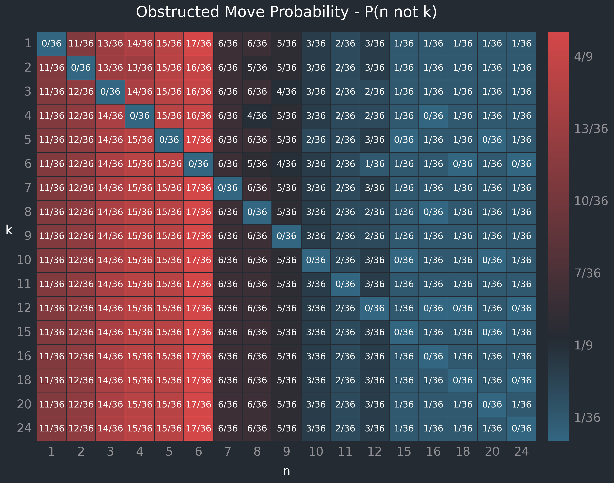

# Backgammon

**Overview**

Backgammon is a dice-based boardgame, the roots of which date back as many as 5,000 years ([Wikipedia](https://en.wikipedia.org/wiki/Backgammon)) to table games originating in Mesopotamia and Persia.

The use of dice in backgammon presents questions of discrete probability, and also a simple scenario for experimenting with data analysis and visualisation.

The rules on rolling doubles, and of being able to take the face values the dice alone or in combination (see below), make this a (marginally) more interesting subject than classic probability calculations for two six-sided dice.

**Basic rules**

Knowledge of the full rules of backgammon isn't necessary to follow this exercise, but one comprehensive version of the rules (with graphics) can be accessed [here](https://www.bkgm.com/rules.html).

For the purpose of this repo, relevant rules are as follows:

- Players roll two six-sided dice to determine the number of spaces they can move.

- Moves are made separately or in combination; for a roll of [4, 5] a player can move:

  - one piece 4 spaces and a second piece 5 spaces (or vice versa), or
  - one piece a total of 9 spaces.

- A space that contains two or more of the opponent's pieces is obstructed; returning to the [4, 5] example, if the opponent had two pieces on the 4 space, the player:

  - could not move one piece in the sequence [4, 5], since that would require landing on an obstructed space, but
  - could still move one piece [5, 4] since this would move through but not onto the obstructed space.

**Doubles**

Doubles (e.g., [5, 5]) permit four moves rather than two (i.e., [5, 5, 5, 5]), to be used in combination on between one and four pieces.

This makes it possible to reach 15, 16, 18, 20, and 24, but also skews the probabilities of reaching numbers between 1 and 12. For example, the roll [3, 3] grants the moves [3, 3, 3, 3], and could be used to move a single piece 3, 6, 9, or 12 spaces.

## Findings

This repo explores the probabilities of being able to:

1. move _n_ spaces, for each possible move _n_;
2. move either _m_ or _n_ spaces, for each pair of possible moves (_m_, _n_); and
3. move _n_ spaces, and not _k_ spaces, for each pair of possible obstacles and moves (_k_, _n_).

### For each possible move _n_, what is the probability of being able to move _n_ spaces?

Assuming there are no obstructed spaces, P(_n_) is the probability _P_ of being able to move a piece _n_ spaces, within the range of possible moves. Move _n_ is possible if either die shows _n_ as its face value, or if the dice values can be summed to _n_.

The bar graph below depicts P(_n_).

For example, for _n_ = 9: P(9) = 5/36 ≈ 13.89%. In addition to the four standard dice outcomes that sum to 9, [3, 6], [4, 5], [5, 4], and [6, 3], there is an exta means via [3, 3], since this grants the moves [3, 3, 3, 3], and the player could apply three of those values to reach 9.

Doubles make possible five additional moves beyond 12 spaces. These are achieved through combinations of the moves presented via double 4 ([4, 4, 4, 4], for 16), double 5 ([5, 5, 5, 5], for 15 or 20) and double 6 ([6, 6, 6, 6], for 18 or 24).

There is a 1/36 chance of rolling any given double, and thus of reaching each of the values 15, 16, 18, 20, and 24, that can only be reached via doubles. Take 18 and 24: both are reached via double 6, so the probability of **being able to** move that number of spaces is what is related here. Whether a player does opt for either is independent of the probability of being presented with those choices.

The option to separate the face values of each die presents a significant departure from the standard probabilities that result from a simple sum of two dice values, as seen below.

An implication is that the sum of probabilities for the 17 possible moves presented here is greater than 1 - how can this be?

The reason is that the move options do not occupy the same sample space as the rolls; the probability of each of the 36 possible dice rolls is still 1/36, and still sums to exactly 1.

However, unlike the rolls, the move options aren't mutually exclusive: for any given roll, a player has three choices (or more for doubles) of how to move their pieces - choices which overlap with move options presented by other roll outcomes, to varying degrees.

As an example, the roll [6, 1] not only presents the outcome 7, but also 1 and 6 as separate outcomes that could be used for different moves.

This significantly increases the probabilities of achieving each of the numbers from 1 to 6, as compared with a simple sum of values - note that 1 has probability 0 when taking the sum of two dice values, since even the lowest outcome [1, 1] sums to 2, whereas here there is an 11/36 chance (≈ 30.56%) of being able to select 1 as an outcome.

### For each pair of possible moves (_m_, _n_), what is the probability of being able to move **either** _m_ **or** _n_ spaces?

Denoted P(_m_ or _n_), this is the probability _P_ of being able to move a piece either _m_ or _n_ spaces, within the range of possible moves.

The probability is calculated as: P(_m_ or _n_) = P(_m_) + P(_n_) - P(_m_ and _n_).

Since we are concerned with the probability that either _m_ or _n_ is achieved, the probability that both occur is subtracted so as to avoid double-counting.

For example, take _m_ = 5, and _n_ = 7. A roll of [5, 2] could be used to satisfy either 5 or 7, but it is just one roll outcome, and so should be counted only once. By the same rationale, if _n_ = 2 and we roll a double 2 for [2, 2, 2, 2], this is also one outcome that satisfies the condition, regardless of the fact that there exist four different ways to select 2 from [2, 2, 2, 2].

The heatmap below depicts P(_m_ or _n_).

For example, for _m_ = 4 and _n_ = 12 the probability of being able to move either 4 or 12 spaces is: P(4 or 12) = 17/36 ≈ 47.22%.

In the bar graph displayed earlier, the individual probabilities were P(4) = 15/36, and P(12) = 3/36. There exists one instance of overlap in which both 4 and 12 can be achieved: a double 4 for [4, 4, 4, 4]. Therefore, P(4 or 12) = P(4) + P(12) - P(4 and 12) = 15/36 + 3/36 - 1/36 = 17/36 ≈ 47.22%.

Compared with the single P(_n_) case, probabilities under the P(_m_ or _n_) case exhibit the most significant increases for the face values of the dice (from 1 to 6), followed by move pairs involving sums of the dice (from 7 to 12).

Beyond those values, since the values 15, 16, 18, 20, and 24 can only be achieved via doubles, (_m_, _n_) pairs involving these values see either a marginal or no probability increase compared with the standalone case.

To illustrate, 16 can only be achieved through a double 4, for [4, 4, 4, 4]. 16 is contingent on a subset of outcomes that achieve 4, and so P(4 or 16) = P(4) = 15/36 ≈ 41.67%.

Likewise, the outcome 24 is contingent on rolling double 6, for [6, 6, 6, 6]. Pairing this _m_ with any _n_ that is not a multiple of 6, becomes a strict either or case with no overlap.

For _m_ = 24, _n_ = 7: P(24 or 7) = 1/36 + 6/36 - 0/36 = 7/36 ≈ 19.44%.

### For each possible move _n_, what is the probability of being able to move _n_ spaces under the constraint of obstacle _k_?

I have borrowed the standard notation P(_n_ not _k_) here, though the actual probability applied to backgammon is less straightforward.

First the standard definition: P(_n_ not _k_) is the probability of _n_ occuring, and not _k_, calculated as: P(_n_ not _k_) = P(_n_) - P(_n_ and _m_).

For example, for P(6 not 5) we would take the probability P(6), and subtract instances of 6 that rely on 5 (i.e., the pairs [1, 5] and [5, 1]).

For an obstructed backgammon space _k_ = 5, however, 6 could still be reached due to the ability to select the dice values in either order: in this case, by moving 1 and then 5 to reach 6, since this will not result in the piece landing on the 5 space.

The effect of obstructed spaces comes into play when multiples are involved: taking 6 again, rolling [3, 3] for _k_ = 3 succeeds in blocking the move, since the piece can't avoid landing on the obstructed 3 space through any combination of the dice values.

The heatmap below depicts P(_n_ not _k_).

As is to be expected, for any case where _n_ = _k_, P(_n_ not _k_) = 0.

The heatmap shows that the introduction of obstacles results in three broad groups of probabilities: for moves 1 to 6, 7 to 12, and 15 to 24.

The higher-valued doubles moves from 15 to 24 become even less probable, since an obstruction of any multiple of their factors makes them inaccessible (e.g. for _k_ = 5, a double 5 gives [5, 5, 5, 5], but these cannot be used to reach 5, 10, 15, or 20).

Of the values from 1 to 12, there is a slight reduction in probability for cases where doubles become inaccessible or _n_ = _k_, but otherwise the effect of the obstacle is mitigated since the player can reverse the move order for non-double cases.

## Conclusion

These examples use a simplified model of backgammon, to consider probability with regards to the moves of just one or two pieces. In a real game, each player has up to 15 pieces across up to 24 spaces at any one time, and so the range of movements and obstructed spaces is much more complex.

Still, the findings make clear the divergence from standard probability outcomes for two six-sided dice, and demonstrate that the effect of being able to use roll outcomes individually or in combination is to significantly increase the probability of being able to move between 1 and 6 spaces relative to other moves, at the same time that the range of possible outcomes is extended due to double rolls.

If a player lands their piece on a space containing one of their opponent's pieces - but not two or more, since that would obstruct the space - the opponent's piece is removed from the board and must re-enter from the start on the opponent's next turn.

This suggests that a player who is risk-averse in defence and aggressive in offence, should seek to maintain a greater distance between their lone pieces and their opponent's pieces, but create obstacles of their own pieces up close to their opponent, to maximise the chance of being able to remove the opponent's pieces from the board.
