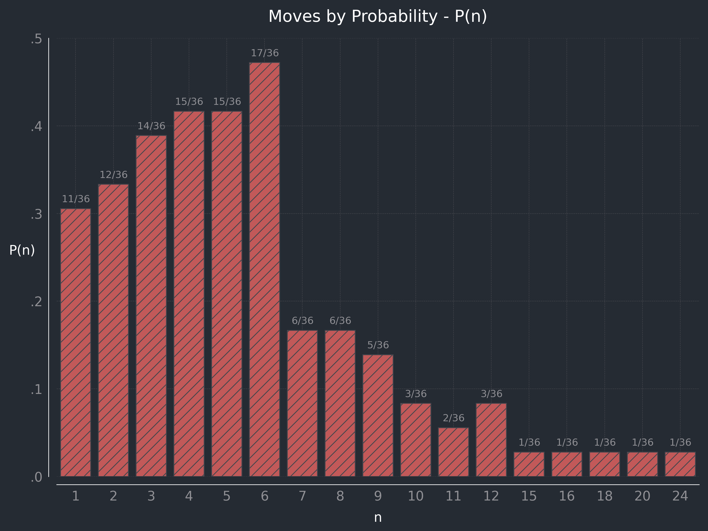

# Backgammon

**Overview**

The use of dice in backgammon presents questions of discrete probability, and also a simple scenario for experimenting with data analysis and visualisation.

The rule on rolling doubles, and the feature of being able to take the face value of each die alone or in combination (see below), make this a (marginally) more interesting subject than typical probability calculations for two six-sided dice.

**Background**

Backgammon is a boardgame, the roots of which date back as many as 5,000 years ([Wikipedia](https://en.wikipedia.org/wiki/Backgammon)) to table games originating in Mesopotamia and Persia.

The modern game involves two players alternating turns to roll two six-sided dice, the scores of which determine how many spaces each player may move their own pieces.

**Rules**

Knowledge of the full rules of backgammon isn't necessary to follow this exercise, but one typical version (with graphics) can be accessed [here](https://www.bkgm.com/rules.html).

For the purpose of this repo, relevant rules are as follows:

- The board consists of 24 points (spaces).
- Players take alternate turns.
- Players roll two dice to determine the number of spaces they can move each turn.

- Moves are made separately or in combination; for a roll of [4, 5], a player can move:

  - one piece 4 spaces and a second piece 5 spaces, or
  - one piece 9 spaces.

- If a double is thrown (e.g., [5, 5]), the player gets four moves rather than two (i.e., [5, 5, 5, 5]), which again can be used separately or in combination on between 1 and 4 pieces.

- Players can only move their pieces onto a space that is either:

  - empty,
  - contains their own pieces, or
  - has just one piece belonging to their opponent.

- Upon landing on an opponent's lone piece, the opponent's piece is removed to the "bar" and must re-enter from that player's starting point on their next turn.

**Note on possible moves**

The "bar" is effectively point (space) 0, so the total range of moves that a piece could move during one turn is from 1 to 24 spaces (24 in the case of rolling [6, 6]) - though not all numbers within that range are achievable.

The doubles rule makes it possible to reach 15, 16, 18, 20, and 24, as well as skewing the probabilities of reaching the face value numbers between 1 and 12.

**About this repo**

Questions explored within this repo, include:

1. Given the position of an opponent's lone piece _n_ spaces away from a player's piece, what is the probability that the player will be able to land their piece on the opponent's position?

<figure>
    
    <figcaption>E.g., the probability of being able to land on an opponent's piece 9 spaces away is 5/36, or approx. 13.89%</figcaption>
</figure>

2. What are the combined probabilities of being able to attack an opponent's lone piece from multiple spaces belonging to the player? (An expansion of Question 1.)

3. The probability of attacking an opponent's piece under movement constraints - i.e., where inbetween spaces are obstructed by two or more opposing pieces, and cannot be landed on.
